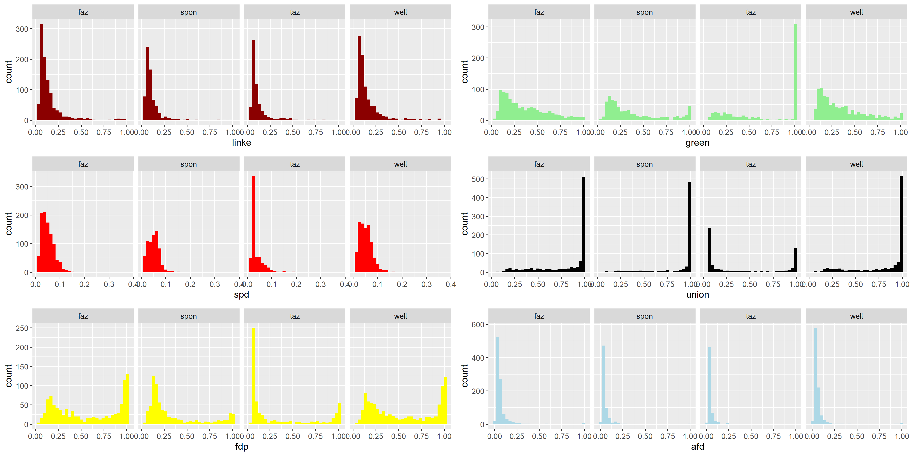

# Measuring news bias with supervised deep learning
## Project as part of Slava Jankin and Hannah Bechara's Deep Learning Course

   Newspapers are one of the most important institutions in contemporary democracies. They have the power to affect voting behaviour, as well as polarise the electorate or motivate them to turn out to vote. Therefore, it is surprising that few papers deploy sate-of-the-art Deep Learning technologies to classify ideological bias in news articles. We apply a transformer neural network to classify party press releases by authorship. This model is then applied and optimised to estimate ideological bias in news articles. We validate the model using op-eds by politicians and compare pre-trained model to a BERT model that was not fine-tuned on party press releases. This approach provides a novel way to train models on political language in the absence of direct training data.

