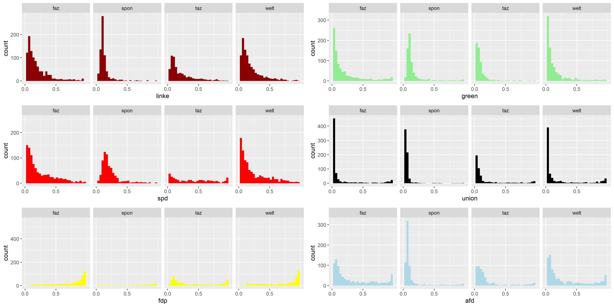

# Measuring news bias with supervised deep learning
## Project as part of Slava Jankin and Hannah Bechara's Deep Learning Course

**A brief, non-technical explainer can be found [here](https://nicolaiberk.com/nlpdl_project.html).**

   The measurement of ideology is one of the major applications of text analysis in political science. However, researchers often face scarcity of available labelled data to train supervised models for their specific domain. Manual annotation is costly and often severely affected by subjective bias. We propose to fine-tune transformer models on available, labelled political texts issued by political parties to obtain a classifier of political ideology. Using a unique dataset of newspaper articles authored by politicians, we test such an application in the German context. Comparing transformer neural networks fine-tuned on a set of party press releases, a set of newspaper articles, or both, we present evidence on the feasibility of such an approach. This contributes to the broad literature on text analysis in the political domain, enabling researchers to train powerful deep learning models on political language with scarce training data. Additionally, we contribute a state-of-the-art deep learning model for the measurement of ideological bias in news articles. This is a crucial issue in the debates surrounding media effects on polarisation, turnout, and voting behaviour.
   
   

