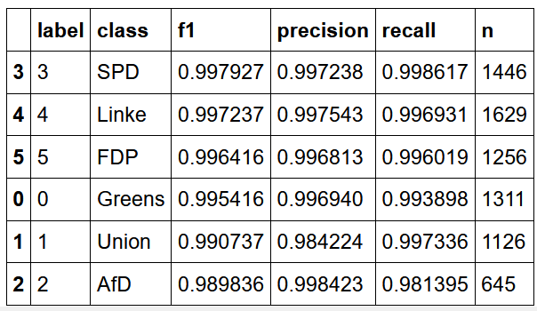

```{r setup, include=FALSE}
knitr::opts_chunk$set(echo = FALSE)

# Load dependencies 
library(reticulate) # For rendering Python code 
```

## Problem

Often, political scientists want to measure ideological bias in political texts, such as newspapers. While supervised techniques provide an efficient tool to address this problem, we often lack available labels to train these supervised models. Additionally, the labelling of political slant is often not straightforward and affected by coders' biases.

We propose to use information from political texts with available labels - namely the press releases of political parties - to assess the relative placement of political texts with transformer models [@Devlin2019]. This cross-domain approach should enable researchers to assess the political bias in content that is costly or hard to label. Moving beyond existing approaches which infer political bias from the issuing actors [@Widmer2020] or specific phrases used by politicians  [@Gentzkow2010], we apply state-of-the-art transformer models to measure the similarity of newspaper articles to the language of political parties.


## Task

To understand how information from political actors can be used to understand ideological bias in other context, we train several DistilBERT transformer models^[https://huggingface.co/distilbert-base-german-cased] on a collection of over 28,000 German party press releases issued between 2013 and 2019, collected by the SCRIPTS project^[https://www.scripts-berlin.eu/]. These are then applied to a random subsample of 4,000  German newspaper articles from six major newspapers, published between 2013 and 2019, collected by one of the authors in a previous project^[https://github.com/nicolaiberk/_rrpviol_med]. To validate whether the newspaper placement by our classifiers conforms to general expectations about the ideological bias of these newspapers, we use data from a survey of newspaper readers asking them about the partisan bias of their newspaper [@GLES2017RCS].


## Proposed method

We assess the use of cross-domain learning to identify newspaper slant in two main studies^[Note that the paper distinguished three studies. For the sake of simplicity, we clump the first two into one]. A pre-trained transformers model is fine-tuned on our set of press releases to identify the authoring party. 

In study 1, we use the DistilBERT model with different training and test sets and compare performance: first, we train on the full set of releases issued between 2013 and 2019 and assess the performance on a test set randomly chosen from this data^[This test set was of course ot used in training.]. Second, to exclude the possibility that the model only infers from references to the political parties, we 'blindfold' the classifier by censoring any references to the parties. Lastly, we split training and test set temporally, meaning the classifier needs to predict the labels of press releases published after the period from which the training data was sampled. If the model picks up general patterns about the parties' language, the performance on this set should only decrease slightly, meaning that the model should correctly predict the authoring party of the press release most of the time. Comparing performance using these different training and validation sets, we can assess whether the classifiers perform as expected.

In study 2, these models are applied to a range of newspaper articles, indicating which parties' communication an article most resembles. These estimates are compared to the expectations about newspaper slant formulated by the survey respondents. Ideally, the models show little respnsiveness to changes in the input data and closely resemble the survey estimates.

## Results

**Study 1**: 

As described, we start by assessing the model's performance on a set of press releases issued in the same period as the training data. The results are shown in [the table](#fig:perf_init){reference-type="ref" reference="fig:perf_init"}. As the reader can see, the model performs at a very high, near-perfect level for all categories. The impressive performance of this model on the press releases was rather surprising. Indeed, this performance seemed too good to be true and raised a number of concerns, most notably regarding issues of overfitting.

[Table: Distilbert model performance on unaltered in-sample test set:]{#fig:perf_init label="fig:perf_init"}
{width="60%"}

To assess whether this is the case, we \"blindfolded\" our model by excluding party labels and any words referring to the parties (such as party-related colours) from the analysis ^[the full list of excluded terms can be found in Appendix A of the final report]. Additionally, we look at out-of-sample predictions to assess whether the model is overfitting. This means that we train the model (as before) on press releases published before 01.01.2018, but assess the performance on data after this date. If the model performance drops off significantly, this would suggest that the classifier picks up and incorporates party-specific clues or speech patterns that could artificially inflate its accuracy. Should the model continue to perform at such a high level, we would have to start considering that the model is indeed this accurate.

For the in-sample, blindfolded set, performance is virtually identical. This is very, very surprising, given that the most obvious cues - references to other parties - are missing in the training data. Have been removed. This indicateone of three things. First, the performance might accurately describe the classifiers ability to distinguish partisan differences in language. We will discuss this option further in a moment. Second, we might have missed some obvious cues in the blindfolding process. While our dictionary of party references is rather extensive, it might still omit important cues that we did not think of. A third option is that BERT is too powerful, learning some spurious statistical cues to place party press releases with parties [@DBLP].

As stated previously, this performance, while impressive, will likely not suffice to convince us that no overfitting is taking place. We therefor use this model to predict the authoring party in an out-of sample dataset. If the performance is strongly affected, we are overfitting on the training set. [The table below](#fig:perf_out){reference-type="ref" reference="fig:perf_out"} shows the performance for this test sample. As we can see, the performance is still very high for many parties, nearly perfectly predicting press releases issued bythe Greens, Linke, and Union. AfD and FDP show somewhat decreased but still good performance, although the recall for FDP press releases is not great at .72. However, the precision is severely decreased for the SPD at about .52. Inspection of the cross tabulation for predicted and actual labels (not shown) indicates that the classifier confuses AfD and FDP press releases for SPD press releases.

These results do not give a definite answer to whether the classifier performs as intended. The numbers just seem a little too good. Given that AfD and SPD occupy opposite ends of the ideological spectrum and that one is an opposition, the other a governing party, a well-performing classifier should not confuse the two. It is thus more likely that the classifier picks up spurious relationships in the data that we do not understand. However, before concluding, we will assess  whether the newspaper estimates produced by the DistilBert model are in line with our expectations and stable across different specifications.

[Table: Distilbert Model performance on out-of-sample test set with party references removed:]{#fig:perf_out label="fig:perf_out"}
{width="60%"}


**Study 2**:

We now move on to assess the estimates for newspaper bias produced by these different models, classifying a set of 4,000 newspaper articles. We can generate a baseline expectation using for the similarity of each newspaper to different parties using survey data from the 2017 German Longitudinal Election Study's Rolling Cross-Section [@GLES2017RCS]. The study asked respondents whether they read a daily newspaper, and if so, whether they felt the newspaper's reporting favored certain parties over others. While these estimates are likely biased by the respondents own political stances (and as such likely underestimate the ideological extremity of their paper), they do provide a first clue. 

[The table](#tab:gles){reference-type="ref" reference="tab:gles"} shows the aggregated results of this question. We can see that FAZ and Welt are placed closer to the centre-right Union, but also SPD and FDP, while the more left-wing TAZ is placed close to the three centre-left and left parties (Linke, Grüne, SPD). None of the newspapers is considered to contain coverage particularly favorable for the AfD.


: Validation reference: readers' assessment of newspapers' bias[]{label="tab:gles"}

|Paper | Linke  | Grüne  | SPD    | Union  | FDP    | AfD    |    N  |
|:-----|:------:|:------:|:------:|:------:|:------:|:------:|:-----:|                                                             
|FAZ   |$0.01$  | $0.02$ | $0.11$ | $0.33$ | $0.11$ |  $0$   | $390$ |
|TAZ   |$0.23$  | $0.24$ | $0.27$ | $0.16$ | $0.04$ |  $0$   |  $89$ |
|Welt  |$0.01$  | $0.02$ | $0.18$ | $0.35$ | $0.09$ | $0.03$ | $209$ |

Based on this expectation, we can assess the validity of the classifier's estimates of newspaper bias.


: Mean similarity estimate to each party by newspaper, based on training data including party labels.[]{label="tbl:means"}

|Paper | Linke  | Grüne  | SPD    | Union  | FDP    | AfD    |    
|:-----|:------:|:------:|:------:|:------:|:------:|:------:|                                                             
|FAZ   |$0.15$  | $0.36$ | $0.05$ | $0.81$ | $0.58$ | $0.08$ |
|TAZ   |$0.13$  | $0.69$ | $0.04$ | $0.41$ | $0.32$ | $0.05$ |
|Welt  |$0.15$  | $0.35$ | $0.05$ | $0.81$ | $0.55$ | $0.07$ |


[The table above](#tbl:means){reference-type="ref" reference="tbl:means"} shows the average probability of party authorship assigned by the initial, uncesored in-sample classifier. As expected, FAZ and Welt are very similar to the centre-right Union (81%) and FDP (58%/55%), but also rather similar to the Greens (36%/35%). While they show the highest similarity to the AfD (8%/7%), similarity to the radical-right party is generally on a very low level among all newspapers. As expected, the TAZ shows a comparatively different profile, being very similar to the Greens (average likelihood 70%), and less similar to the Union parties (41%), the FDP (32%), and  the AfD (5%). Surprisingly, it also shows the lowest similarity to the Linke (13%). Maybe most surprising is the general low similarity to SPD press releases (4%/5%). It seems the party has a rather distinctive rhetorical style.

To see if these estimates are robust across training, we first use the blindfolded classifier, before temporally specifying the train-test split. The results of these experiments can be seen in [the table below](#tab:pred_blind). The minor changes in the training data severely affected our results. Resemblance of all newspapers towards Greens and Union have strongly decreased, while resemblance to Linke, SPD, AfD, and especially FDP has strongly increased. All newspapers (including the left-wing TAZ) are now estimated to strongly resemble the FDP instead of the Union. While the higher estimates for SPD are welcomed and in line with readers' assessment, the strong resemblance with the FDP is puzzling, as are the relatively high scores for the AfD and low scores for the Union. The Greens are now least represented in all newspapers. Even the left-wing TAZ bears stronger similarities to the far-right AfD than the Grüne. The right-wing newspapers are now showing the highest similarity to the SPD, which is non-intuitive and in direct contradicition to our survey data. All newspapers show very weak resemblance to Union press
releases, again contradicting the survey data^[Assessing data with no blindfolding but temporal restrictions affects the model in a similar way as below, but with higher estimates for AfD and Greens, and lower estimates for FDP.].

: Placement of newspapers using time-restricted and blindfolded classifier.[]{#tab:pred_blind label="tab:pred_blind"}

|Paper  | Linke  | Grüne  | SPD    | Union  | FDP    | AfD    |    
|:------|:------:|:------:|:------:|:------:|:------:|:------:|                                                             
|FAZ    | $0.17$ | $0.08$ | $0.35$ | $0.10$ | $0.95$ | $0.20$ |  
|TAZ    | $0.62$ | $0.08$ | $0.23$ | $0.07$ | $0.60$ | $0.17$ |  
|Welt   | $0.16$ | $0.11$ | $0.31$ | $0.10$ | $0.93$ | $0.20$ |  


## Analysis

While all classifiers perform well on the party press releases and correctly place the newspapers relative to each other, the comparison of classifiers reveals a startling instability in the estimates. Small changes in the input data resulted in vastly different estimates of newspaper bias. It seems that cross-domain applications of deep learning are highly sensitive to the form of the input data and that their application is not as straightforward as hoped. For the moment, it is unclear whether this method can provide stable estimates.


## Conclusions

The recommendation at this point is that researchers with cross-domain classification problems think hard about their input data, carefully validating their results, or apply simpler techniques where the estimates are more directly interpretable, such as regression. Nevertheless, cross-domain applications of deep learning are a promising avenue for further research. Future work here should assess how properties of the input data affect estimates in another domain and think carefully about validation to develop best practices for researches seeking to apply such methods.


## Acknowledgments

We thank the vast community contributing to the development of machine learning tools, specifically huggingface. Additionally, we want to thank Lukas Stötzer for provision of the training data and Hauke Licht for providing us with a first notebook. Most importantly, we want to thank Slava Jankin, Hannah Bechara, and Huy Dang for providing us with the skills to pursue this project.